# Capturas de pantalla de la interfaz y vistas

## Creación de tablas

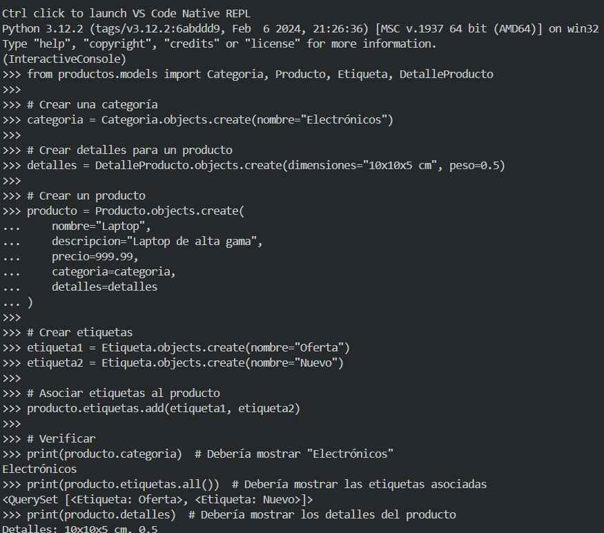

------------------------------------------------------------------------

## Interfaz Admin de Django

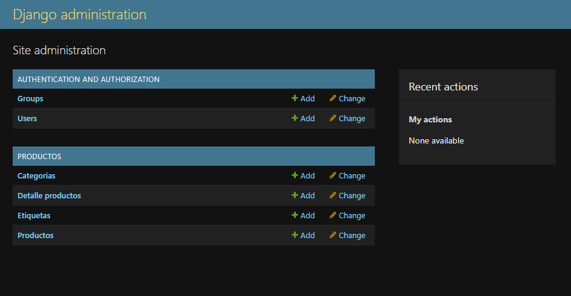
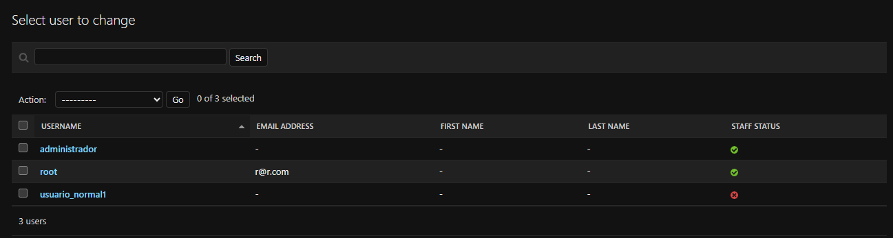
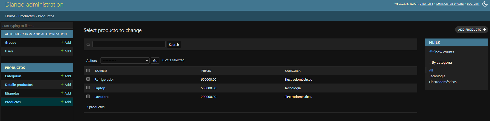
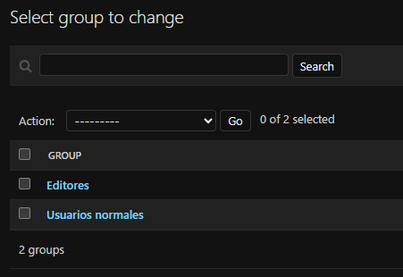

------------------------------------------------------------------------

## Vistas

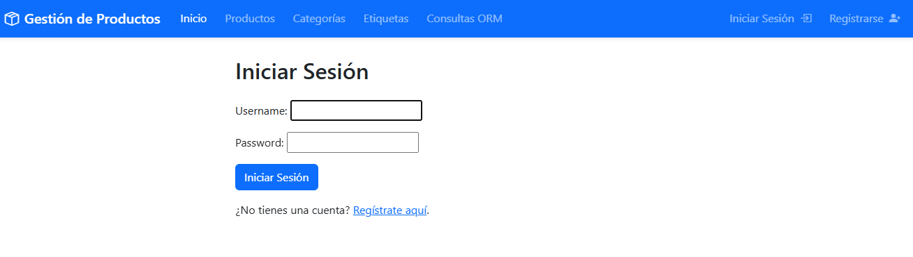
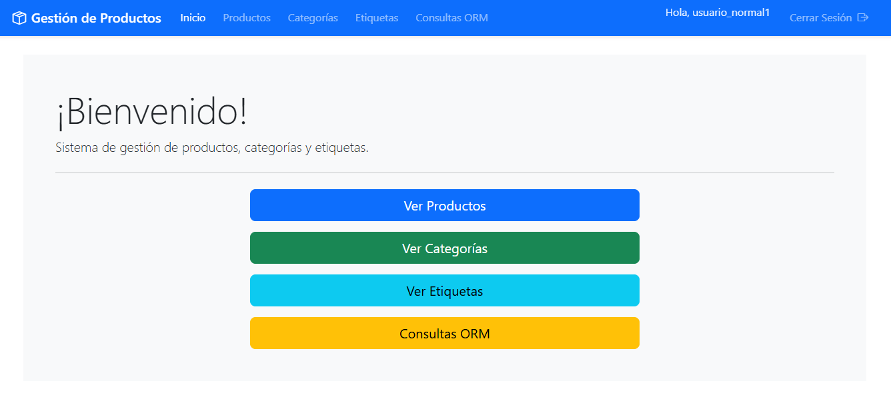
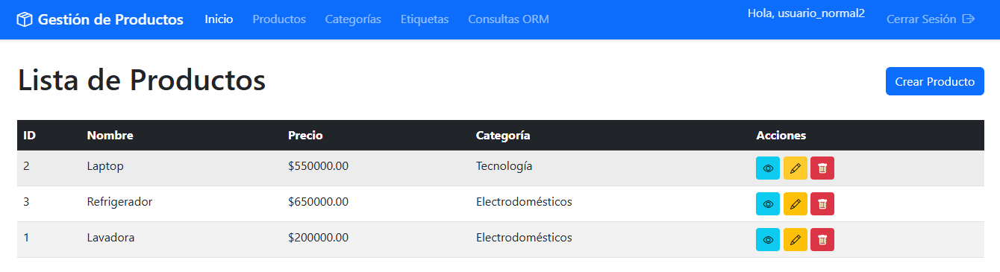
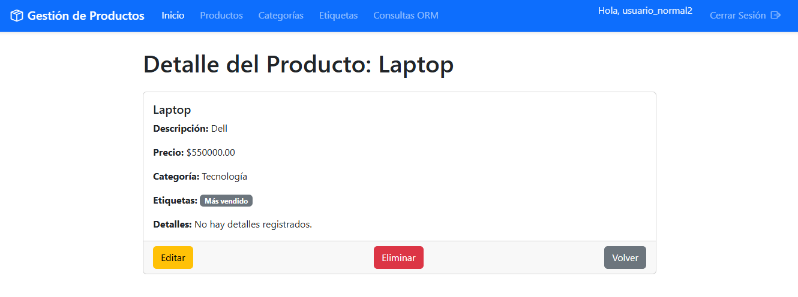
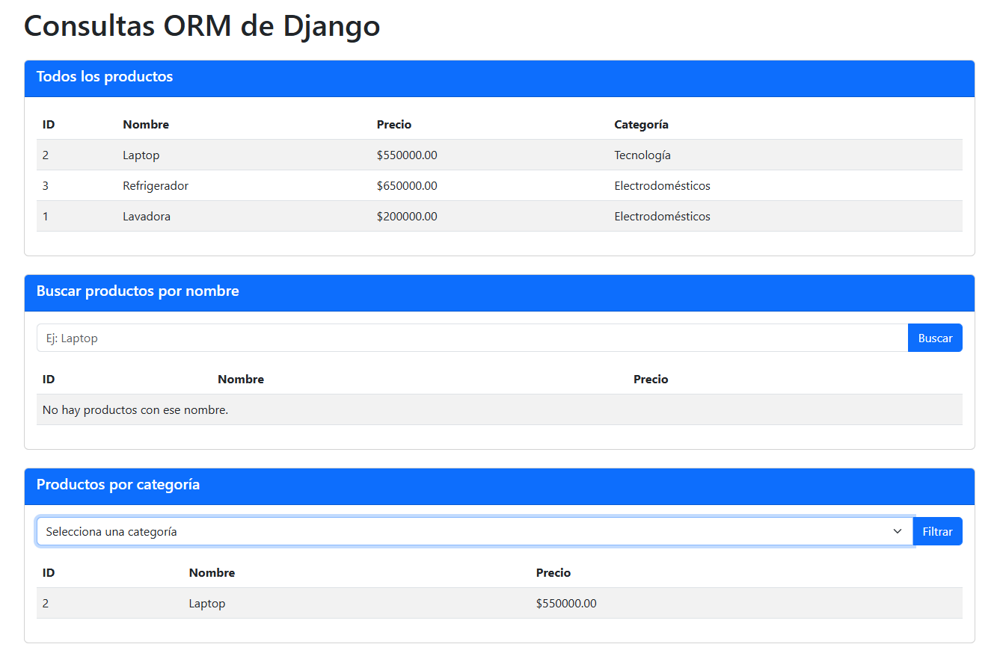
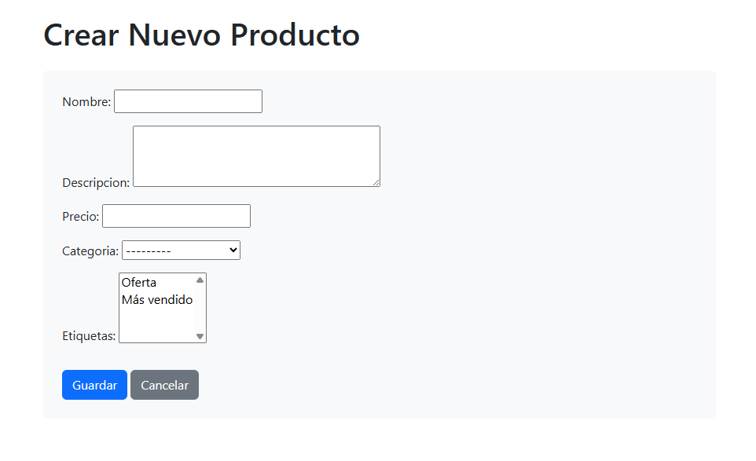
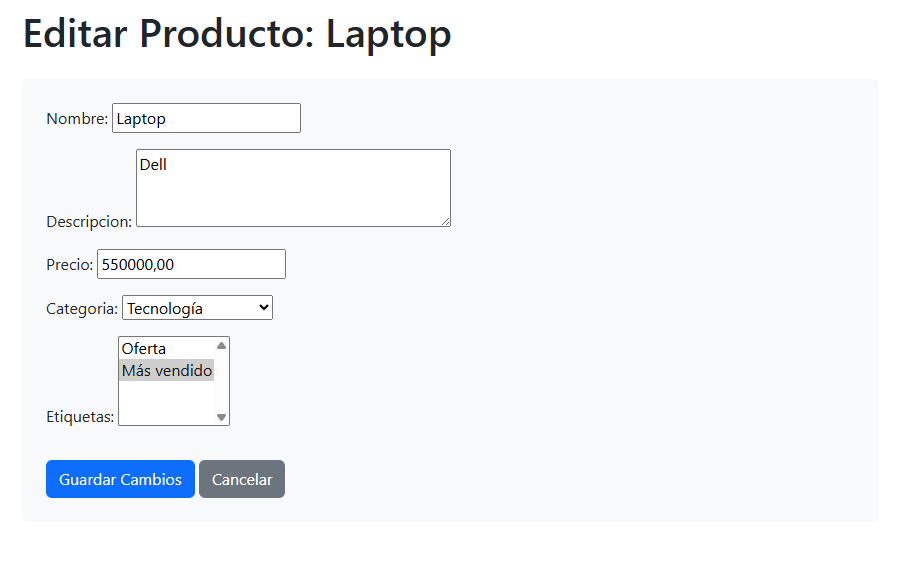

------------------------------------------------------------------------

## Alertas

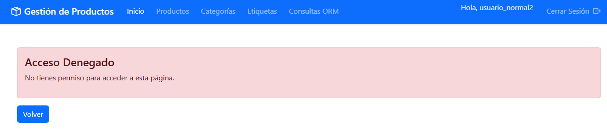
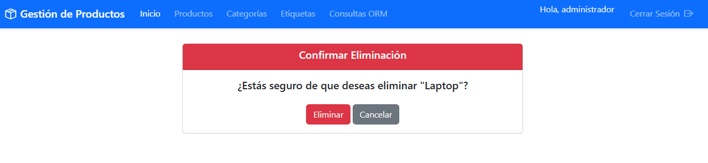